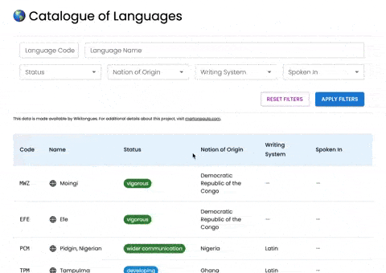

# 🌎 Catalogue of Languages

    

**Catalogue of Languages** is an interactive table featuring all documented languages from the Wikitongues database. Built on the [_Every Language in the World_](https://www.airtable.com/universe/exph5qycoKpX7tPwO/every-language-in-the-world) Airtable dataset, it provides an easy way to explore global linguistic diversity.

Featuring more than ~8,000 records, this project aims to make language research simple and accessible, serving as a resource for researchers, linguists, students, and enthusiasts.

This project follows a Feature-Based Architecture, where functionalities are organized into dedicated modules such as `languages`, `nations`, and `writingSystems`. This approach enhances scalability, maintainability, and code clarity, making it easier to expand and improve the project over time.

<br />



🔗 Live project: [catalogue-of-languages.vercel.app](https://catalogue-of-languages.vercel.app/)

## Introduction

The **Catalogue of Languages** project was born out of a personal interest in languages and linguistics. As someone who enjoys learning about different writing systems, language structures, and cultural diversity, this project was a natural fit. Beyond being a technical challenge, it was also an opportunity to explore a topic I genuinely enjoy while applying my development skills.

## 🔧 Features

1. **Table Display and Infinite Scroll**

   - Fetches and displays data from the Airtable public dataset.
   - Provides columns for language code, name, and additional metadata based on available fields.
   - Allows infinite scrolling for smoother data navigation.
   - Ensures a seamless loading experience when fetching more data.

2. **Search and Filtering Functionalities**

   - Adds a search input to filter table data (e.g., by language name or code).
   - Offers filter chips for quick data filtering.
   - Supports multiple criteria for more refined searches.

3. **Language Details Page**

   - Displays detailed information for each language.
   - Includes additional metadata like writing system, region, and status.

## 🔍 Overview

### Scalability Considerations

- **Clean, reusable code and components** to facilitate the addition of new features.
- **Best practices** in state management and API handling to accommodate future changes or new endpoints.
- **Scalable folder structure** that supports future codebase growth and modular expansion.

### User Experience

- **Responsive design** for smooth navigation across different devices.
- **Robust error handling** to gracefully manage API errors and loading states.
- **Intuitive interactions** for an effortless browsing and searching experience.

## 🛠️ Tech Stack

### Frontend Framework

**React + Next.js (TypeScript)**

- Combines SSG and SSR for optimized performance and SEO.
- Dynamic routing supports detailed pages like `/:code` for each language.

### State Management

**React Hooks**

- Utilized for functional components, side effects, and local state handling.

**Zustand**

- Lightweight and efficient global state management.
- Persists user preferences (e.g., filters) in `localStorage`.

### Form Handling & Validation

**React Hook Form + Zod**

- React Hook Form for building flexible and performant forms.
- Zod for schema-based validation.

### Styling

**Material UI + Material Icons**

- Pre-built components for responsive design and clean visuals.
- WCAG-compliant with accessible patterns.

### Data Fetching

**React Query**

- Efficient caching and refetching for robust API interaction.

### Additional Tools

- **Axios** for HTTP requests.
- **ESLint** for consistent code styling and error detection.
- **Vercel** for deployment with automated builds and previews.
- **GitHub Actions** for Continuous Integration.

### **Tech Stack Considerations**  

Initially, **Next.js**, **React Hook Form**, and **Zod** were chosen with scalability in mind. The idea was to build a solid foundation that could support future growth, such as API routes, server-side rendering (SSR), or more complex forms with dynamic validation.  

However, looking at the current state of the project, this choice might have been overkill. The application consists of only two client-side pages, and the only form could have been handled more simply using **Material UI's built-in form controls** and error handling. A lighter setup with **React + Vite** might have been a more efficient approach.  

That said, going through this process was valuable. It helped refine my decision-making when selecting tools for a project. It reinforced the importance of assessing immediate needs versus long-term goals and finding the right balance between **familiarity, maintainability, and complexity**.

## 🚀 Getting Started

### Prerequisites

- **Node.js** (v18 or above)
- **npm** (or another package manager)

### Installation

1. **Clone the repository**:

   ```bash
   git clone https://github.com/martonpaulo/catalogue-of-languages.git
   cd catalogue-of-languages
   ```

2. **Install dependencies**:

   ```bash
   npm install
   ```

3. **Start the development server**:

   ```bash
   npm run dev
   ```

4. **Open the app** at `http://localhost:3000`.

## 📋 Available Scripts

| Script          | Description                                        |
| --------------- | -------------------------------------------------- |
| `npm run dev`   | Starts the development server locally.             |
| `npm run build` | Builds the app for production.                     |
| `npm run start` | Starts the production server (after building).     |
| `npm run lint`  | Runs ESLint to check for style and quality issues. |

## 🌐 API Overview

This project uses data from the Wikitongues [_Every Language in the World_](https://www.airtable.com/universe/exph5qycoKpX7tPwO/every-language-in-the-world) table, publicly available on Airtable. The API is based on a private copy of this dataset hosted in an Airtable workspace.

### API Endpoint Structure

Airtable API requests generally follow this structure:

```
https://api.airtable.com/v0/{baseId}/{tableId}?maxRecords={maxRecordsNumber}
```

- `{baseId}` starts with `"app"`, `{tableId}` starts with `"tbl"`.
- Authentication via **Bearer Token**.

### Example Request

```http
GET https://api.airtable.com/v0/{baseId}/{tableId}?maxRecords=10
Authorization: Bearer YOUR_API_KEY
```

For more details, see the [Airtable API documentation](https://airtable.com/developers/web/api/).

## 🗂️ Architecture

Below is a simplified representation of the folder structure that follows a modular approach. Each major domain (languages, nations, writing systems) has its own directory under `src/features`.

```plaintext
src/
├── app/                       # Next.js App Router structure
│   ├── api/                   # API route handlers (server-side)
│   │   ├── languages/         # Proxy endpoints for languages data
│   │   │   ├── [code]/        # Endpoint for specific language details
│   │   │   └── route.ts       # Endpoint for listing all languages
│   │   ├── nations/           # Endpoint for nations data
│   │   └── writing-systems/   # Endpoint for writing systems data
│   ├── icon.svg               # SVG icon rendered automatically by Next.js
│   ├── layout.tsx             # Layout wrapper for the entire app
│   ├── not-found.tsx          # Custom 404 page
│   ├── (homepage)
│   │   └── page.tsx           # Homepage component
│   └── [code]/                # Dynamic route for language details (e.g., /:code)
├── features/                  # Domain-driven feature directories
│   ├── languages/
│   │   ├── components/        # UI components specific to languages
│   │   ├── hooks/             # Language-related React hooks
│   │   ├── services/          # API service calls for languages
│   │   ├── store/             # Zustand store for languages state
│   │   ├── types/             # TypeScript definitions for languages
│   │   └── utils/             # Utility functions for data mapping, filtering
│   ├── nations/               # Similar structure for nations
│   └── writingSystems/        # Similar structure for writing systems
├── middleware/                # Custom middleware for origin checks and security
└── shared/                    # Shared utilities and components
```

## 🔒 Handling CORS Issues

To bypass CORS restrictions, **Next.js API routes** serve as a proxy. This allows client-side requests to interact with Airtable without browser-based CORS errors.

- A **middleware** enforces strict origin checks based on environment variables. If `NEXT_PUBLIC_API_STRICT_ORIGIN` is set to `true`, only requests from the allowed origins (`NEXT_PUBLIC_API_ALLOWED_ORIGINS`) can access these proxy routes.

## 🌐 Environment Variables

Below is a list of the main environment variables used in this project:

| Variable                          | Purpose                                                                                            |
| --------------------------------- | -------------------------------------------------------------------------------------------------- |
| `AIRTABLE_API_KEY`                | Private Airtable API key for authenticated requests.                                               |
| `AIRTABLE_BASE_ID`                | The base identifier for your Airtable workspace.                                                   |
| `LANGUAGES_TABLE_ID`              | The table ID containing the languages data.                                                        |
| `WRITING_SYSTEMS_TABLE_ID`        | The table ID containing the writing systems data.                                                  |
| `NATIONS_TABLE_ID`                | The table ID containing nation-related data.                                                       |
| `NEXT_PUBLIC_API_STRICT_ORIGIN`   | Boolean to enable or disable strict origin checks on the API proxy.                                |
| `NEXT_PUBLIC_API_ALLOWED_ORIGINS` | Comma-separated list of allowed origins, e.g., `https://catalogue-of-languages.vercel.app/`.       |
| `NEXT_PUBLIC_STORAGE_PREFIX`      | A prefix for all keys saved in localStorage                                                        |
| `NEXT_PUBLIC_STORAGE_VERSION`     | Used for versioning localStorage data, ensuring older data can be handled when the schema changes. |

## 🔖 Commit Strategy

Each commit follows a clear, consistent naming convention:

| Type       | Description                               | Example                                 |
| ---------- | ----------------------------------------- | --------------------------------------- |
| `feat`     | Introduces new features.                  | `feat: add filtering functionality`     |
| `fix`      | Fixes bugs.                               | `fix: resolve validation issue in form` |
| `docs`     | Updates documentation.                    | `docs: add setup instructions`          |
| `refactor` | Refactors code without changing behavior. | `refactor: improve component structure` |
| `chore`    | Updates build process or tools.           | `chore: update dependencies`            |

### Simplified Approach Explanation

- Not all commit types or extended formats (e.g., `<type>[optional scope]: <description>`) are necessary for a smaller project like this. Overcomplicating the commit process can slow down development without offering significant advantages.
- In this repository, commits were made **directly to the `main` branch**, which is generally not recommended for larger projects. For more complex applications, feature branches and pull requests ensure a cleaner and more organized commit history.

## 🧗 Challenges Faced

1. **Airtable SDK Documentation**
   The Airtable SDK documentation was incomplete or confusing, leading to reliance on community forums. Eventually, **Axios** was chosen for more straightforward control over HTTP requests.

2. **Pagination Limitations**
   Airtable’s pagination does not provide a total record count, necessitating an **infinite scroll** approach rather than a traditional paged solution.

3. **Infinite Scroll Implementation**
   Balancing performance and preventing excessive API calls required careful logic to detect when to load more data.

4. **LocalStorage Data Limit**
   Storing all ~8,000 records locally exceeded `localStorage` limits, so persisting the full dataset became impractical.

5. **Large Data Volume**
   Handling thousands of records caused initial navigation to be slow, highlighting the need for efficient data fetching and rendering.

6. **Inconsistent Language Data**
   The Airtable table itself contains incomplete or inconsistent fields, requiring careful data checking and fallback UI states.

## 📈 Future Improvements to Consider

- **GraphQL + BaseQL**: Replace Airtable API with a GraphQL-based approach and integrate Apollo Client for more efficient queries and caching.
- **Expanded Routing**: Create dedicated routes for each country or region.
- **Advanced Filtering**: Use multiple filter chips for more dynamic, multi-criteria search.
- **Additional Data Points**: Enrich the table with more fields for each language, providing a deeper data exploration experience.

## 🏁 Final Thoughts

This project has been a rewarding challenge—applying modern frontend tech, focusing on code clarity, and creating an application that can grow in complexity. Building it from scratch provided an excellent opportunity to solidify design principles, maintain high code quality, and ensure a clean, maintainable structure.

## 📄 License

This project is licensed under the **MIT License**. See the [LICENSE](LICENSE) file for details.
