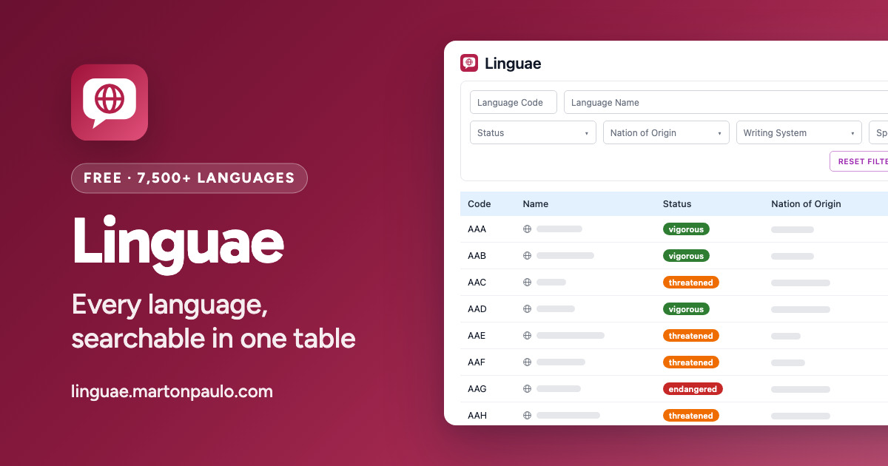

<div align="center">



# Linguae

Interactive table featuring all documented languages from the Wikitongues database, providing an easy way to explore global linguistic diversity.

[](https://github.com/martonpaulo/linguae/actions/workflows/ci.yml) [](https://nextjs.org/) [](https://react.dev/) [](https://www.typescriptlang.org/)

</div>

**Linguae** is an interactive catalogue of every language the Wikitongues dataset documents. It is
built on the [_Every Language in the World_](https://www.airtable.com/universe/exph5qycoKpX7tPwO/every-language-in-the-world)
Airtable base, and it currently publishes **7,554 languages**, **217 nations** and **126 writing
systems** — searchable, filterable, and with a page of its own for each language.

The project was born out of a personal interest in languages and linguistics, and it stayed a
**purely static site**: there is no backend, no runtime API and no credential in the browser.
Airtable is read **at build time only**, projected onto an explicit list of public fields, and
written as one versioned snapshot that the exported HTML carries with it.

---

<br />

## 🌱 Quick Start

```bash
git clone https://github.com/martonpaulo/linguae.git
cd linguae
npm ci
npm run snapshot:fixture
npm run dev
```

Then open [http://localhost:3000](http://localhost:3000).

`npm run snapshot:fixture` writes a small synthetic catalogue. Without a snapshot the build has
nothing to generate pages from and fails with a message saying so. **Airtable credentials are not
required** to run the project; they are only needed to generate a snapshot from the real dataset:

```bash
cp .env.example .env.local   # then fill in the Airtable values locally
npm run snapshot
npm run dev
```

Prerequisites: **Node.js 22 or newer** (CI runs 22) and npm.

<br />

## 🛠 Commands

| Command | Description |
| --- | --- |
| `npm run dev` | Development server. Needs a snapshot to exist. |
| `npm run snapshot` | Generates the public snapshot from Airtable. Requires the build-only credentials. |
| `npm run snapshot:fixture` | Generates a synthetic snapshot. No credentials needed. |
| `npm run build` / `npm run build:export` | Builds the static export into `out/`, under the published base path. |
| `npm run serve:export` | Serves `out/` the way GitHub Pages does, for checking the real artifact. |
| `npm run lint` / `npm run lint:fix` | ESLint over the whole repository. |
| `npm test` | The acceptance suite, in Chromium, Gecko and WebKit. |
| `npm run test:chromium` | The same suite in one engine, for faster iteration. |
| `npm run measure:derivation` | Benchmarks enrichment, filtering and revealing at 50 to 8,000 languages. |
| `npm run snapshot:scaled` | Generates an 8,000-language synthetic snapshot, for feasibility measurement. |
| `npm run social-card` | Renders `design/social-card/social-card.html` into `public/social-card.jpg` (on a Mac). |

<br />

## 🔐 Secrets and variables

| Variable | Where | Purpose |
| --- | --- | --- |
| `AIRTABLE_API_KEY` | Build only | Airtable personal access token with read access |
| `AIRTABLE_BASE_ID` | Build only | The base holding the dataset copy |
| `LANGUAGES_TABLE_ID` | Build only | Languages table |
| `WRITING_SYSTEMS_TABLE_ID` | Build only | Writing systems table |
| `NATIONS_TABLE_ID` | Build only | Nations table |
| `NEXT_PUBLIC_BASE_PATH` | Build | Sub-path the site is published under. Empty locally. |
| `NEXT_PUBLIC_STORAGE_PREFIX` | Build | Namespace for the stored filter preferences |
| `NEXT_PUBLIC_STORAGE_VERSION` | Build | Version suffix for that key |

The five Airtable variables are used by the snapshot generator and reach no browser bundle. In CI
they are **repository secrets, referenced only by the publication job**. Locally they live in
`.env.local`, which `npm run snapshot` reads if it exists; `.env.example` holds the shape. Keep
credential values out of Git, out of commit messages and out of issues.

---

<br />

## How it works

Airtable is read at build time. A generator projects the records onto an explicit list of public
fields, validates them, and writes one versioned snapshot. The site is then exported as static
HTML and published to GitHub Pages.

```text
Airtable  ──(build, with secrets)──►  snapshot  ──(next build)──►  static export  ──►  GitHub Pages
```

That has three consequences worth knowing before reading the code:

- **The browser never talks to Airtable**, and no API key exists in the deployed artifact. The build verifies this before uploading.
- **Each language page is generated with its record already in it.** Opening a language costs no request, and a code the snapshot does not publish has no page, so the host's own 404 answers it.
- **The catalogue list loads one snapshot index** and filters, sorts and reveals rows locally. Filtering does not issue a request.

Data refreshes on each deployment, and a manual refresh is available. A failed or partial
generation never replaces the published site.

Read [the product definition](docs/product.md) for scope and non-goals, [AGENTS.md](AGENTS.md) for
the working agreements, [CONTRIBUTING.md](CONTRIBUTING.md) to report a bug or propose a change, and
[the backlog](https://github.com/martonpaulo/linguae/issues) for what is planned.

<br />

## Features

1. **Table display and incremental loading**

   - Presents every language the snapshot publishes, with code, name, status, nation of origin, writing system and where it is spoken.
   - Reveals rows in steps of 50 as you scroll, over data that is already loaded.

2. **Search and filtering**

   - Free-text matching on language code and name, and exact category matching on status, nation of origin, writing system and where a language is spoken.
   - Filters apply on **Apply**, not on every keystroke, and are remembered between visits.
   - Only status categories the snapshot actually publishes are offered.

3. **Language pages**

   - A page per language with alternate names, dialects, status notes, genealogy, demographics, use, development, typology, description, writing systems and nations.
   - Reachable by a real link, so it can be opened with the keyboard, in a new tab, or copied.

<br />

## Tech stack

| Concern | Choice | Notes |
| --- | --- | --- |
| Framework | **Next.js 15 (App Router), TypeScript** | Static export (`output: "export"`), published under a base path |
| UI | **MUI + Material Icons** | Theme and shared styles in `src/shared/styles` |
| Data loading | **TanStack Query** | Owns request state and in-memory caching for the snapshot assets |
| Forms | **React Hook Form + Zod** | Zod validates the filter form *and* the filters restored from storage |
| Build tooling | **tsx** | Runs the TypeScript build scripts, which reuse the app's own mappers |
| Tests | **Playwright** | The one test runner; drives Chromium, Gecko and WebKit |

The catalogue list is client-rendered from a snapshot asset, so it needs JavaScript. Language pages
do not: their content is in the exported HTML.

### What this project deliberately does not use

There is no HTTP client dependency — the build-time reader and the browser both use `fetch`. There
is no client state-management library: TanStack Query owns fetched data and React owns the rest.
Nothing but the filter preferences is written to browser storage.

<br />

## Validation

```bash
npm run lint
npx tsc --noEmit --incremental false
npm run build:export
npm test
```

`npm test` builds the real static export from the synthetic fixture snapshot and drives it through
the three accepted browser engines. It deliberately does not use the development server: the
development server answers an unknown route differently from the deployed artifact, so it cannot
prove the 404 contract.

A successful run does not verify private Airtable access, screen-reader behavior, or the deployed
site. To check a published deployment, point the live suite at its origin:

```bash
LIVE_URL=<deployed origin> npx playwright test liveDeployment
```

<br />

## Architecture

Each domain owns its types, services, hooks, mapping utilities and UI. Shared code lives in
`src/shared` only when its responsibility is genuinely shared.

<br />

## The published snapshot

The generator writes two sets of files. Only the first is served.

| Path | Served | Contents |
| --- | --- | --- |
| `public/catalogue/index.json` | ✅ | Every language, with the fields the table renders |
| `public/catalogue/nations.json` | ✅ | Nation ids and names |
| `public/catalogue/writing-systems.json` | ✅ | Writing-system ids and names |
| `.snapshot/manifest.json` | — | Version, generation time, and every published code |
| `.snapshot/languages/<code>.json` | — | One record per language, embedded into its page at build time |

Every file in a generation carries the same `version`, which is a hash of the content: regenerating
unchanged data produces the same version, so a browser's cached assets are not invalidated for
nothing.

Records without a usable three-letter code or a name are rejected, as are duplicate codes. The
generator reports how many it skipped and by record id — never by content.

<br />

## Continuous integration

`.github/workflows/ci.yml` has three responsibilities, and they cost very different amounts:

| Job | Runs on | Secrets |
| --- | --- | --- |
| Lint and types | Every push and pull request, every path | None |
| Browser acceptance | Only when a path it can observe changed | None; builds the synthetic snapshot |
| Publish to Pages | Push to `main` or manual dispatch, only when an artifact path changed | The five Airtable secrets, in this job only |

A pull request cannot reach publication, from this repository or a fork. When the base revision of
a push cannot be compared, every path is treated as changed rather than as no change, so nothing is
skipped on a guess.

Before uploading, the workflow refuses an export that is missing its entry points, has no generated
language pages, or contains any Airtable variable name or the Airtable host.

<br />

## Commit strategy

One commit per subject, directly on `main`.

| Type | Description |
| --- | --- |
| `feat` | Introduces a capability |
| `fix` | Corrects behavior |
| `refactor` | Changes structure, preserves behavior |
| `test` | Adds or changes tests |
| `docs` | Documentation |
| `build` / `chore` / `ci` | Tooling, dependencies, pipeline |

A commit made for an issue ends with `(#<issue number>)`.

<br />

## Challenges faced

1. **Airtable's SDK documentation** was incomplete, so the reader is written directly against the REST API with `fetch`, following offsets serially per table.

2. **Airtable pagination gives no total count**, which originally forced infinite scroll over remote pages. The static snapshot removed that constraint: the count is known at build time and revealing rows is now local.

3. **The full dataset does not fit in `localStorage`.** Persisting the catalogue was abandoned in favour of persisting only the filter preferences and letting ordinary HTTP caching handle the data.

4. **A 7,554-page static export is 341 MB.** That is comfortably inside the GitHub Pages limit, but it was measured before committing to the approach rather than assumed.

5. **The source data is inconsistent.** Sixteen records carry an unusable language code and are skipped; unrecognised status labels are deliberately mapped to no category at all, because presenting them as a known one would be a fabrication.

<br />

## Possible improvements

1. **A smaller catalogue index.** It is 1.29 MB raw and 227 KB gzipped, which is the largest thing a first visit downloads.

2. **Dedicated routes per nation or writing system**, using relations the snapshot already carries.

3. **Multi-value filters**, so several statuses or nations can be selected at once.

---

<br />

## Limitations

- The catalogue is a **build-time snapshot**, so a correction in Airtable appears only after the next deployment or a manual refresh.
- The catalogue list needs JavaScript. Language pages do not.
- Sixteen source records carry an unusable language code and are not published; unrecognised status labels are shown as no category rather than guessed.
- Filters accept **one value per category**, and there are no routes per nation or writing system.
- The catalogue index is 1.29 MB raw (227 KB gzipped) and is downloaded in full on a first visit.

<br />

## License and attribution

[MIT](LICENSE) © 2026 Marton Paulo.

The catalogue data is made available by [Wikitongues](https://wikitongues.org/); the code license
does not grant rights over it.
