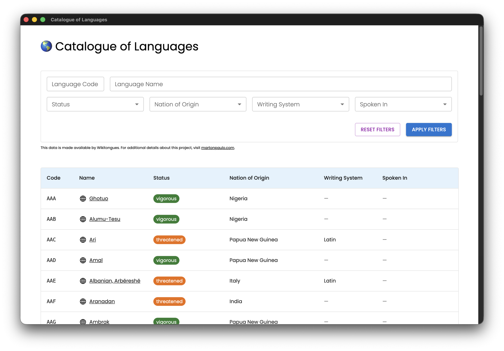
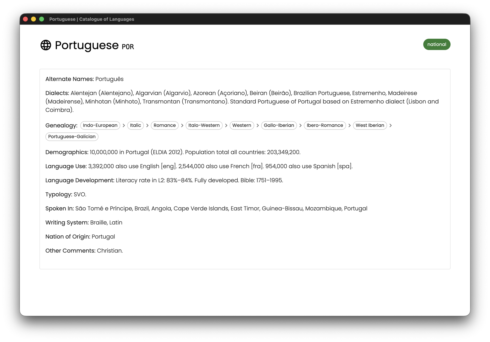

# 🌎 Linguae

    

**Linguae** is an interactive table featuring all documented languages from the Wikitongues database. Built on the [_Every Language in the World_](https://www.airtable.com/universe/exph5qycoKpX7tPwO/every-language-in-the-world) Airtable dataset, it provides an easy way to explore global linguistic diversity.

The published catalogue currently holds **7,554 languages**, **217 nations** and **126 writing systems**, and it is a purely static site: there is no backend, no runtime API and no credential in the browser.

🔗 **[linguae.martonpaulo.com](https://linguae.martonpaulo.com/)**





## How it works

Airtable is read **at build time only**. A generator projects the records onto an explicit list of public fields, validates them, and writes one versioned snapshot. The site is then exported as static HTML and published to GitHub Pages.

```text
Airtable  ──(build, with secrets)──►  snapshot  ──(next build)──►  static export  ──►  GitHub Pages
```

That has three consequences worth knowing before reading the code:

- **The browser never talks to Airtable**, and no API key exists in the deployed artifact. The build verifies this before uploading.
- **Each language page is generated with its record already in it.** Opening a language costs no request, and a code the snapshot does not publish has no page, so the host's own 404 answers it.
- **The catalogue list loads one snapshot index** and filters, sorts and reveals rows locally. Filtering does not issue a request.

Data refreshes on each deployment, and a manual refresh is available. A failed or partial generation never replaces the published site.

Read [the product definition](docs/product.md) for scope and non-goals, [AGENTS.md](AGENTS.md) for the working agreements, and [the backlog](https://github.com/martonpaulo/linguae/issues) for what is planned.

## Introduction

The **Linguae** project was born out of a personal interest in languages and linguistics. As someone who enjoys learning about different writing systems, language structures, and cultural diversity, this project was a natural fit. Beyond being a technical challenge, it was also an opportunity to explore a topic I genuinely enjoy while applying my development skills.

## 🔧 Features

1. **Table display and incremental loading**

   - Presents every language the snapshot publishes, with code, name, status, nation of origin, writing system and where it is spoken.
   - Reveals rows in steps of 50 as you scroll, over data that is already loaded.

2. **Search and filtering**

   - Free-text matching on language code and name, and exact category matching on status, nation of origin, writing system and where a language is spoken.
   - Filters apply on **Apply**, not on every keystroke, and are remembered between visits.
   - Only status categories the snapshot actually publishes are offered.

3. **Language pages**

   - A page per language with alternate names, dialects, status notes, genealogy, demographics, use, development, typology, description, writing systems and nations.
   - Reachable by a real link, so it can be opened with the keyboard, in a new tab, or copied.

## 🛠️ Tech stack

| Concern | Choice | Notes |
| --- | --- | --- |
| Framework | **Next.js 15 (App Router), TypeScript** | Static export (`output: "export"`), published under a base path |
| UI | **MUI + Material Icons** | Theme and shared styles in `src/shared/styles` |
| Data loading | **TanStack Query** | Owns request state and in-memory caching for the snapshot assets |
| Forms | **React Hook Form + Zod** | Zod validates the filter form *and* the filters restored from storage |
| Build tooling | **tsx** | Runs the TypeScript build scripts, which reuse the app's own mappers |
| Tests | **Playwright** | The one test runner; drives Chromium, Gecko and WebKit |

The catalogue list is client-rendered from a snapshot asset, so it needs JavaScript. Language pages do not: their content is in the exported HTML.

### What this project deliberately does not use

There is no HTTP client dependency — the build-time reader and the browser both use `fetch`. There is no client state-management library: TanStack Query owns fetched data and React owns the rest. Nothing but the filter preferences is written to browser storage.

## 🚀 Getting started

### Prerequisites

- **Node.js 22 or newer** (CI runs 22)
- **npm**

Airtable credentials are **not** required to run the project. They are only needed to generate a snapshot from the real dataset.

### Run it

```bash
git clone https://github.com/martonpaulo/linguae.git
cd linguae
npm ci
npm run snapshot:fixture
npm run dev
```

Then open `http://localhost:3000`. `npm run snapshot:fixture` writes a small synthetic catalogue; without a snapshot the build has nothing to generate pages from and fails with a message saying so.

### Run it against the real dataset

```bash
cp .env.example .env.local   # then fill in the Airtable values locally
npm run snapshot
npm run dev
```

`npm run snapshot` reads `.env.local` if it exists. Keep credential values out of Git, out of commit messages and out of issues.

## 📋 Scripts

| Script | Description |
| --- | --- |
| `npm run dev` | Development server. Needs a snapshot to exist. |
| `npm run snapshot` | Generates the public snapshot from Airtable. Requires the build-only credentials. |
| `npm run snapshot:fixture` | Generates a synthetic snapshot. No credentials needed. |
| `npm run build:export` | Builds the static export into `out/`, under the published base path. |
| `npm run serve:export` | Serves `out/` the way GitHub Pages does, for checking the real artifact. |
| `npm run lint` / `npm run lint:fix` | ESLint over the whole repository. |
| `npm test` | The acceptance suite, in Chromium, Gecko and WebKit. |
| `npm run test:chromium` | The same suite in one engine, for faster iteration. |
| `npm run measure:derivation` | Benchmarks enrichment, filtering and revealing at 50 to 8,000 languages. |
| `npm run snapshot:scaled` | Generates an 8,000-language synthetic snapshot, for feasibility measurement. |
| `npm run social-card` | Regenerates `public/opengraph-image.png`. |

## ✅ Validation

```bash
npm run lint
npx tsc --noEmit --incremental false
npm run build:export
npm test
```

`npm test` builds the real static export from the synthetic fixture snapshot and drives it through the three accepted browser engines. It deliberately does not use the development server: the development server answers an unknown route differently from the deployed artifact, so it cannot prove the 404 contract.

A successful run does not verify private Airtable access, screen-reader behavior, or the deployed site. To check a published deployment:

```bash
LIVE_URL=https://linguae.martonpaulo.com/ npx playwright test liveDeployment
```

## 🗂️ Architecture

Each domain owns its types, services, hooks, mapping utilities and UI. Shared code lives in `src/shared` only when its responsibility is genuinely shared.

```plaintext
src/
├── app/                       # Next.js App Router
│   ├── (homepage)/page.tsx    # The catalogue
│   ├── [code]/page.tsx        # One generated page per published language code
│   ├── layout.tsx             # Providers, site metadata, structured data
│   ├── not-found.tsx          # The exported 404
│   ├── sitemap.ts             # Every generated page, under the deployed prefix
│   └── icon.svg
├── features/
│   ├── languages/
│   │   ├── components/        # Table, row, filters, status chip, details
│   │   ├── hooks/             # Composed catalogue state and published statuses
│   │   ├── server/            # Build-time snapshot reader for generated pages
│   │   ├── services/          # Snapshot index reader
│   │   ├── styles/            # Shared language styles
│   │   ├── types/             # Language and status types
│   │   └── utils/             # Mapping, enrichment, filtering
│   ├── nations/               # Same shape
│   └── writingSystems/        # Same shape
└── shared/
    ├── components/            # Layout, loading, error, controlled select
    ├── config/                # Base path, origin and site identity, declared once
    ├── providers/             # Theme and query client
    ├── services/              # Snapshot asset reader
    ├── styles/                # Theme and fonts
    ├── types/                 # Airtable record and snapshot contracts
    └── utils/                 # Guarded browser storage

scripts/
├── snapshot/                  # Build-only Airtable reader and snapshot builder
├── fixtures/                  # Synthetic source for credential-free generation
├── screenshots/               # README capture, documented in the script itself
├── generate-snapshot.ts       # Real, fixture and scaled generation
├── generate-social-card.ts    # The 1200x630 social card
├── measure-derivation.ts      # Derivation benchmark
└── serve-export.ts            # Static server with GitHub Pages semantics

tests/                         # Playwright acceptance suite
.github/
├── workflows/ci.yml           # Validation, acceptance and publication
└── scripts/                   # Path gating and artifact verification
```

## 📦 The published snapshot

The generator writes two sets of files. Only the first is served.

| Path | Served | Contents |
| --- | --- | --- |
| `public/catalogue/index.json` | ✅ | Every language, with the fields the table renders |
| `public/catalogue/nations.json` | ✅ | Nation ids and names |
| `public/catalogue/writing-systems.json` | ✅ | Writing-system ids and names |
| `.snapshot/manifest.json` | — | Version, generation time, and every published code |
| `.snapshot/languages/<code>.json` | — | One record per language, embedded into its page at build time |

Every file in a generation carries the same `version`, which is a hash of the content: regenerating unchanged data produces the same version, so a browser's cached assets are not invalidated for nothing.

Records without a usable three-letter code or a name are rejected, as are duplicate codes. The generator reports how many it skipped and by record id — never by content.

## 🔐 Environment variables

| Variable | Where | Purpose |
| --- | --- | --- |
| `AIRTABLE_API_KEY` | Build only | Airtable personal access token with read access |
| `AIRTABLE_BASE_ID` | Build only | The base holding the dataset copy |
| `LANGUAGES_TABLE_ID` | Build only | Languages table |
| `WRITING_SYSTEMS_TABLE_ID` | Build only | Writing systems table |
| `NATIONS_TABLE_ID` | Build only | Nations table |
| `NEXT_PUBLIC_BASE_PATH` | Build | Sub-path the site is published under. Empty locally. |
| `NEXT_PUBLIC_SITE_ORIGIN` | Build | Origin used for canonical, Open Graph and sitemap URLs |
| `NEXT_PUBLIC_STORAGE_PREFIX` | Build | Namespace for the stored filter preferences |
| `NEXT_PUBLIC_STORAGE_VERSION` | Build | Version suffix for that key |

The five Airtable variables are used by the snapshot generator and reach no browser bundle. In CI they are repository secrets, referenced only by the publication job.

## 🚢 Continuous integration

`.github/workflows/ci.yml` has three responsibilities, and they cost very different amounts:

| Job | Runs on | Secrets |
| --- | --- | --- |
| Lint and types | Every push and pull request, every path | None |
| Browser acceptance | Only when a path it can observe changed | None; builds the synthetic snapshot |
| Publish to Pages | Push to `main` or manual dispatch, only when an artifact path changed | The five Airtable secrets, in this job only |

A pull request cannot reach publication, from this repository or a fork. When the base revision of a push cannot be compared, every path is treated as changed rather than as no change, so nothing is skipped on a guess.

Before uploading, the workflow refuses an export that is missing its entry points, has no generated language pages, or contains any Airtable variable name or the Airtable host.

## 📸 Screenshots

`scripts/screenshots/capture.sh` produces the images above from a real browser window on a real screen, so they keep the native macOS shadow, rounded corners and material. The method and the reason for each constraint are documented in the script itself; the short version is that an offscreen render loses the window chrome, `screencapture -o` strips the shadow, a 1x display halves the resolution silently, and an inactive window is captured with a grey traffic light.

```bash
./scripts/screenshots/capture.sh https://linguae.martonpaulo.com/
```

It launches its own browser instance under a throwaway profile, so it can only capture its own window.

## 🔖 Commit strategy

One commit per subject, directly on `main`.

| Type | Description |
| --- | --- |
| `feat` | Introduces a capability |
| `fix` | Corrects behavior |
| `refactor` | Changes structure, preserves behavior |
| `test` | Adds or changes tests |
| `docs` | Documentation |
| `build` / `chore` / `ci` | Tooling, dependencies, pipeline |

A commit made for an issue ends with `(#<issue number>)`.

## 🧗 Challenges faced

1. **Airtable's SDK documentation** was incomplete, so the reader is written directly against the REST API with `fetch`, following offsets serially per table.

2. **Airtable pagination gives no total count**, which originally forced infinite scroll over remote pages. The static snapshot removed that constraint: the count is known at build time and revealing rows is now local.

3. **The full dataset does not fit in `localStorage`.** Persisting the catalogue was abandoned in favour of persisting only the filter preferences and letting ordinary HTTP caching handle the data.

4. **A 7,554-page static export is 341 MB.** That is comfortably inside the GitHub Pages limit, but it was measured before committing to the approach rather than assumed.

5. **The source data is inconsistent.** Sixteen records carry an unusable language code and are skipped; unrecognised status labels are deliberately mapped to no category at all, because presenting them as a known one would be a fabrication.

## 📈 Possible improvements

1. **A smaller catalogue index.** It is 1.29 MB raw and 227 KB gzipped, which is the largest thing a first visit downloads.

2. **Dedicated routes per nation or writing system**, using relations the snapshot already carries.

3. **Multi-value filters**, so several statuses or nations can be selected at once.

## 📄 License

This project is licensed under the **MIT License**. See the [LICENSE](LICENSE) file for details.

The catalogue data is made available by [Wikitongues](https://wikitongues.org/); the code license does not grant rights over it.
